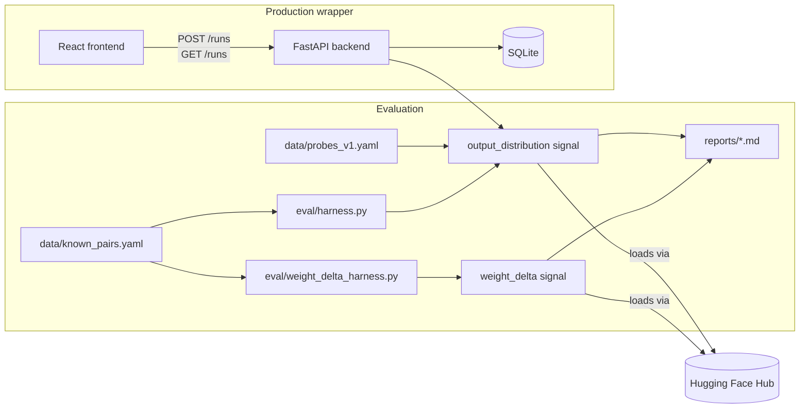

# Model Provenance Verifier

[](https://github.com/Annkkitaaa/model-provenance-verifier/actions/workflows/ci.yml)
[](requirements.txt)
[](LICENSE)

Determines how likely it is that a candidate language model was derived from a base
model (via fine-tuning, LoRA, merging, quantization, or distillation), with a
calibrated confidence score and a written evidence report instead of a binary
yes/no answer.

## Key findings

Two independent verification signals, evaluated on a 12-pair labeled set
(`data/known_pairs.yaml`). Full numbers in [`reports/phase1_report.md`](reports/phase1_report.md),
[`reports/phase2_report.md`](reports/phase2_report.md), and [`reports/evasion_report.md`](reports/evasion_report.md):

- **Signal 1, output-distribution**: 83.3% accuracy, 28.6% false-positive rate, 0%
  false-negative rate at the best threshold on this set (a measurement on this set, not a
  validated production threshold).
- **A systematic failure mode, found twice independently**: two unrelated "sibling"
  models that share gpt2's tokenizer and architecture (`gpt2-medium`, and a from-scratch
  Stanford CRFM reproduction of GPT-2-small) both score *higher* than three of the five
  genuine fine-tune/LoRA/distillation pairs. Same mechanism, two different models - not a
  one-off.
- **Signal 2, weight-delta**: compares weights directly instead of behavior. Near-perfect
  on the cases it can even be computed on (0.9998-0.99997 for real fine-tunes/LoRA vs.
  0.191 for an unrelated same-architecture model) - except one real fine-tune that moved
  its weights further than expected, scoring 0.476 (a false negative at the 0.5
  threshold).
- **The two signals fail on different pairs.** Weight-delta gets both of
  output-distribution's false positives right; output-distribution gets weight-delta's
  false negative right.
- **A constructed evasion case makes this concrete**: a LoRA adapter trained
  specifically against the 60 public probe prompts fools output-distribution (score 0.416,
  below the related range) while leaving weight-delta essentially untouched (0.99996,
  indistinguishable from an ordinary LoRA fine-tune).
- **Quantization**: int8 dynamic quantization dropped the signal by ~0.12; real NF4 4-bit
  quantization (bitsandbytes, verified genuinely running on CPU, not GPU-only as first
  assumed) dropped it by only ~0.035 - a counterintuitive but explainable result (NF4 is
  information-theoretically tuned for neural network weight distributions; naive int8 is
  not). Neither broke detection.
- **A model merge** (mergekit, linear) is correctly flagged as related to both parent
  models by both signals.

## Architecture



## Why a calibrated score instead of a verdict

A similarity signal between two models is only useful if you know how often it is
wrong. This project treats every detection signal as a measurement with a known
false-positive rate and false-negative rate, measured against a labeled set of
known-related and known-unrelated model pairs, rather than as ground truth. The
written report keeps three things separate:

- Evidence: what was actually measured (for example, cosine similarity of output
  distributions on a fixed probe set)
- Interpretation: what that measurement is consistent with
- Hypothesis: a plausible explanation that goes beyond what was directly measured

## Project status

This repository is built incrementally, one feature per pull request. See the
build plan below for the current phase.

### Phase 1: single verification signal, properly evaluated

- [x] `data/known_pairs.yaml`: labeled set of known-positive and known-negative
      model pairs
- [x] Output-distribution fingerprinting signal
- [x] Eval harness: accuracy, false-positive rate, false-negative rate, and a
      per-pair breakdown of misclassifications
- [x] `reports/phase1_report.md`: measured results and at least one documented
      failure case

### Phase 2: robustness under modification

- [x] Re-run the signal against a quantized version of a known-positive
      derivative model (int8 dynamic, and real NF4 4-bit via bitsandbytes)
- [x] Optional: test against a model merge (mergekit, linear)

### Phase 3: production wrapper

- [x] FastAPI backend (`POST /runs`, `GET /runs/{id}`) persisted to SQLite
- [x] Minimal React/TypeScript frontend: submit a comparison, list past runs,
      view the evidence breakdown
- [x] Tests for the eval harness scoring logic and the API run lifecycle

### Stretch

- [x] A second verification signal (weight-delta similarity), with a report comparing
      which signal is more robust under which modification type
- [ ] Hidden-state/activation comparison at a specific layer
- [x] A deliberate-evasion test: construct a case designed to fool the signal
      ([`reports/evasion_report.md`](reports/evasion_report.md))

## Models used

Small, widely available open-weight models so this runs on CPU or a single
consumer GPU. The exact model IDs used for the evaluation set are recorded in
`data/known_pairs.yaml` so the eval is reproducible from a clean checkout.

## Setup

```bash
python -m venv .venv
source .venv/bin/activate    # macOS/Linux
.venv\Scripts\activate       # Windows
pip install -r requirements.txt
```

Optional: copy `.env.example` to `.env` to set `HF_TOKEN` (raises the Hugging Face Hub
rate limit) or override where runs are persisted. Neither is required for the defaults.

## Reproducing the reports

```bash
python eval/harness.py                   # output-distribution signal, all 12 pairs
python eval/weight_delta_harness.py      # weight-delta signal, all 12 pairs
```

These run each signal against every pair in `data/known_pairs.yaml` and print the
calibration numbers that back the claims in `reports/phase1_report.md`.

```bash
python eval/phase2_quantization.py       # int8 dynamic quantization
pip install bitsandbytes
python eval/phase2_4bit_quantization.py  # real NF4 4-bit quantization
pip install "git+https://github.com/arcee-ai/mergekit.git"
python eval/phase2_merge.py              # linear model merge
```

These reproduce the results in `reports/phase2_report.md`. bitsandbytes and mergekit are
not in requirements.txt since only these two scripts need them (see each script's
docstring for why the plain PyPI releases don't work here).

```bash
python eval/evasion_test.py
```

Trains a small adversarial LoRA adapter and reproduces `reports/evasion_report.md`. Takes
longer than the other scripts (a few minutes) since it actually trains a model.

## Running the API and frontend

```bash
# backend, from the repo root, with the venv above active
uvicorn api.main:app --reload

# frontend, in a separate terminal
cd frontend
npm install
npm run dev
```

The frontend dev server runs at `http://localhost:5173` and expects the API at
`http://127.0.0.1:8000` by default (see `frontend/README.md` to change that). Runs are
persisted to a local `runs.db` SQLite file.

## Tests

```bash
pytest
```

## License

MIT, see `LICENSE`.
