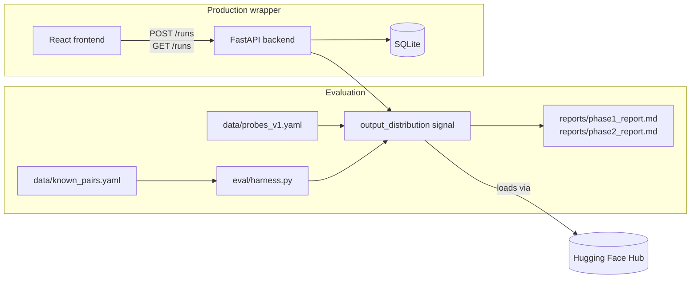

# Model Provenance Verifier

[](https://github.com/Annkkitaaa/model-provenance-verifier/actions/workflows/ci.yml)
[](requirements.txt)
[](LICENSE)

Determines how likely it is that a candidate language model was derived from a base
model (via fine-tuning, LoRA, merging, quantization, or distillation), with a
calibrated confidence score and a written evidence report instead of a binary
yes/no answer.

## Key findings

Measured on an 11-pair labeled evaluation set (`data/known_pairs.yaml`), full numbers in
[`reports/phase1_report.md`](reports/phase1_report.md):

- **90.9% accuracy, 16.7% false-positive rate, 0% false-negative rate** at the
  best threshold on that set (stated as a measurement on this set, not a validated
  production threshold; see the report's limitations section)
- **One real, understood failure mode**: `gpt2` vs `gpt2-medium`, two independently
  trained, unrelated models that happen to share a tokenizer, scores *higher*
  (0.796 cosine similarity) than three of the five genuine fine-tune/LoRA/distillation
  pairs in the set. The report explains the mechanism, not just the number.
- **Quantization**: re-running the signal against an int8-quantized derivative model
  dropped its score by ~0.12 but did not flip the classification
  ([`reports/phase2_report.md`](reports/phase2_report.md))

## Architecture



## Why a calibrated score instead of a verdict

A similarity signal between two models is only useful if you know how often it is
wrong. This project treats every detection signal as a measurement with a known
false-positive rate and false-negative rate, measured against a labeled set of
known-related and known-unrelated model pairs, rather than as ground truth. The
written report keeps three things separate:

- Evidence: what was actually measured (for example, cosine similarity of output
  distributions on a fixed probe set)
- Interpretation: what that measurement is consistent with
- Hypothesis: a plausible explanation that goes beyond what was directly measured

## Project status

This repository is built incrementally, one feature per pull request. See the
build plan below for the current phase.

### Phase 1: single verification signal, properly evaluated

- [x] `data/known_pairs.yaml`: labeled set of known-positive and known-negative
      model pairs
- [x] Output-distribution fingerprinting signal
- [x] Eval harness: accuracy, false-positive rate, false-negative rate, and a
      per-pair breakdown of misclassifications
- [x] `reports/phase1_report.md`: measured results and at least one documented
      failure case

### Phase 2: robustness under modification

- [x] Re-run the signal against a quantized version of a known-positive
      derivative model
- [ ] Optional: test against a model merge

### Phase 3: production wrapper

- [x] FastAPI backend (`POST /runs`, `GET /runs/{id}`) persisted to SQLite
- [x] Minimal React/TypeScript frontend: submit a comparison, list past runs,
      view the evidence breakdown
- [x] Tests for the eval harness scoring logic and the API run lifecycle

## Models used

Small, widely available open-weight models so this runs on CPU or a single
consumer GPU. The exact model IDs used for the evaluation set are recorded in
`data/known_pairs.yaml` so the eval is reproducible from a clean checkout.

## Setup

```bash
python -m venv .venv
source .venv/bin/activate    # macOS/Linux
.venv\Scripts\activate       # Windows
pip install -r requirements.txt
```

Optional: copy `.env.example` to `.env` to set `HF_TOKEN` (raises the Hugging Face Hub
rate limit) or override where runs are persisted. Neither is required for the defaults.

## Reproducing the reports

```bash
python eval/harness.py
```

This runs the signal against every pair in `data/known_pairs.yaml` and prints
the calibration numbers that back the claims in `reports/phase1_report.md`.

```bash
python eval/phase2_quantization.py
```

This reproduces the quantization result in `reports/phase2_report.md`.

## Running the API and frontend

```bash
# backend, from the repo root, with the venv above active
uvicorn api.main:app --reload

# frontend, in a separate terminal
cd frontend
npm install
npm run dev
```

The frontend dev server runs at `http://localhost:5173` and expects the API at
`http://127.0.0.1:8000` by default (see `frontend/README.md` to change that). Runs are
persisted to a local `runs.db` SQLite file.

## Tests

```bash
pytest
```

## License

MIT, see `LICENSE`.
